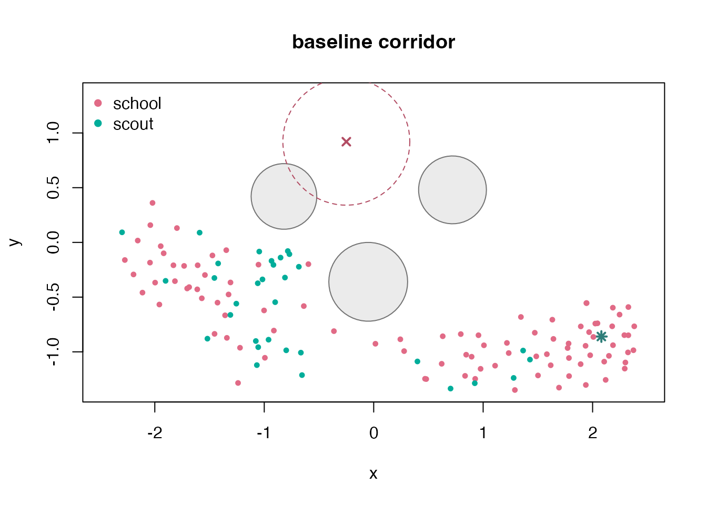
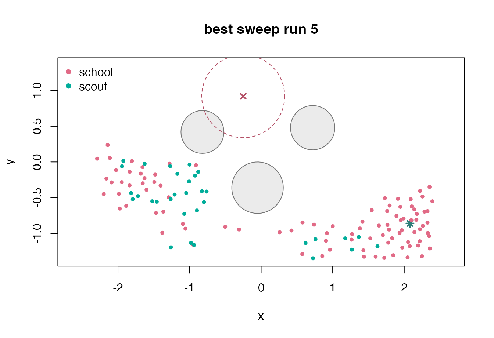
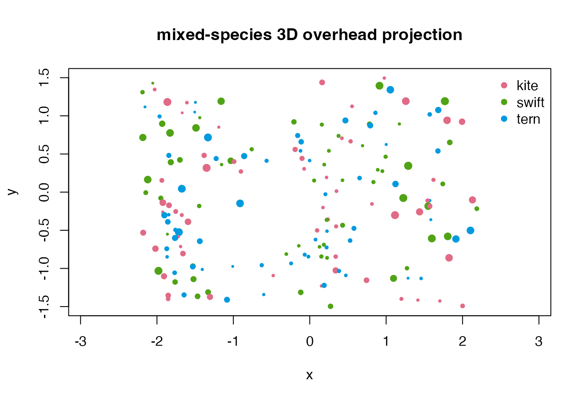

# Custom Simulation Workflows

The named scenarios are convenient starting points, but the lower-level
constructors are intended for custom experiments. This vignette builds a
2D corridor with a goal, obstacles, and a predator zone, then runs a
small parameter sweep. It finishes with a 3D mixed-species example.

``` r
library(boids4R)
```

## Build a corridor experiment

The initial state places two species near the left side of the world.
Obstacles create a staggered corridor, an attractor pulls the swarm
toward the lower-right exit, and a predator zone discourages a direct
high route.

``` r
set.seed(220)

bounds <- matrix(
  c(-2.4, -1.35, 2.4, 1.35),
  ncol = 2,
  dimnames = list(c("x", "y"), c("min", "max"))
)

n_school <- 96L
n_scout <- 32L
n_boids <- n_school + n_scout

positions <- rbind(
  cbind(stats::runif(n_school, -2.18, -1.35), stats::runif(n_school, -0.7, 0.25)),
  cbind(stats::runif(n_scout, -2.22, -1.45), stats::runif(n_scout, 0.28, 0.92))
)
velocities <- cbind(
  stats::runif(n_boids, 0.15, 0.55),
  stats::rnorm(n_boids, 0, 0.08)
)

state <- boids_state(
  n_boids,
  "2d",
  bounds = bounds,
  positions = positions,
  velocities = velocities,
  species = c(rep("school", n_school), rep("scout", n_scout))
)

world <- boids_world(
  "2d",
  bounds = bounds,
  boundary = "reflect",
  obstacles = data.frame(
    x = c(-0.82, -0.05, 0.72),
    y = c(0.42, -0.36, 0.48),
    radius = c(0.30, 0.36, 0.31)
  ),
  predators = data.frame(
    x = -0.25,
    y = 0.92,
    radius = 0.58,
    strength = 1.2
  ),
  attractors = data.frame(
    x = 2.08,
    y = -0.86,
    strength = 0.95
  )
)

params <- boids_params(
  "2d",
  separation_weight = 1.35,
  alignment_weight = 0.94,
  cohesion_weight = 0.62,
  obstacle_weight = 2.5,
  predator_weight = 2.3,
  goal_weight = 0.16,
  max_speed = 1.18,
  max_force = 0.12,
  noise = 0.001
)

corridor <- simulate_boids(
  state,
  world,
  params,
  steps = 85,
  record_every = 5,
  seed = 221
)
```

## Measure progress and clearance

Because output frames are ordinary data frames, experiment-specific
metrics can be written directly. Here we measure final progress toward
the exit, distance from obstacles, and species-level speed.

``` r
final_frame <- function(sim) {
  frames <- as.data.frame(sim)
  frames[frames$frame == max(frames$frame), , drop = FALSE]
}

clearance_to_obstacles <- function(frame, obstacles) {
  if (!nrow(obstacles)) return(rep(Inf, nrow(frame)))
  distances <- vapply(seq_len(nrow(obstacles)), function(i) {
    sqrt(
      (frame$x - obstacles$x[i])^2 +
        (frame$y - obstacles$y[i])^2 +
        (frame$z - obstacles$z[i])^2
    ) - obstacles$radius[i]
  }, numeric(nrow(frame)))
  apply(distances, 1L, min)
}

corridor_metrics <- function(sim, label = NULL) {
  if (is.null(label)) {
    label <- if (is.na(sim$scenario)) "custom" else sim$scenario
  }
  final <- final_frame(sim)
  clearance <- clearance_to_obstacles(final, sim$world$obstacles)
  data.frame(
    run = label,
    exit_fraction = round(mean(final$x > 1.25), 3),
    centroid_x = round(mean(final$x), 3),
    mean_speed = round(mean(final$speed), 3),
    mean_clearance = round(mean(clearance), 3),
    minimum_clearance = round(min(clearance), 3),
    stringsAsFactors = FALSE
  )
}

corridor_metrics(corridor, "baseline")
#>        run exit_fraction centroid_x mean_speed mean_clearance minimum_clearance
#> 1 baseline         0.336      0.078      1.065          1.008             0.189

species_progress <- stats::aggregate(
  cbind(x, speed) ~ species,
  final_frame(corridor),
  mean
)
species_progress$x <- round(species_progress$x, 3)
species_progress$speed <- round(species_progress$speed, 3)
species_progress
#>   species     x speed
#> 1  school  0.34 1.088
#> 2   scout -0.71 0.993
```

## Plot the world and final state

This diagnostic uses only base graphics. Solid circles show obstacles,
the dashed circle shows the predator influence zone, and the star marks
the attractor.

``` r
draw_corridor <- function(sim, title = "corridor final state") {
  final <- final_frame(sim)
  world <- sim$world
  palette <- stats::setNames(
    grDevices::hcl.colors(length(unique(final$species)), "Dark 3"),
    sort(unique(final$species))
  )

  graphics::plot(
    final$x, final$y,
    xlim = world$bounds["x", ],
    ylim = world$bounds["y", ],
    asp = 1,
    xlab = "x",
    ylab = "y",
    main = title,
    type = "n"
  )
  graphics::symbols(
    world$obstacles$x, world$obstacles$y,
    circles = world$obstacles$radius,
    inches = FALSE,
    add = TRUE,
    fg = "gray45",
    bg = grDevices::adjustcolor("gray75", alpha.f = 0.3)
  )
  graphics::symbols(
    world$predators$x, world$predators$y,
    circles = world$predators$radius,
    inches = FALSE,
    add = TRUE,
    fg = "#B24C63",
    lty = 2
  )
  graphics::points(world$predators$x, world$predators$y, pch = 4, col = "#B24C63", lwd = 2)
  graphics::points(world$attractors$x, world$attractors$y, pch = 8, col = "#2F7E79", lwd = 2)
  graphics::points(final$x, final$y, col = palette[final$species], pch = 16, cex = 0.75)
  graphics::legend("topleft", legend = names(palette), col = palette, pch = 16, bty = "n")
}

draw_corridor(corridor, "baseline corridor")
```



## Sweep steering weights

The next block compares eight rule-weight combinations. All runs reuse
the same initial state and world, so differences come from steering
parameters and simulation noise only.

``` r
sweep <- expand.grid(
  obstacle_weight = c(1.8, 2.5),
  predator_weight = c(2.2, 3.0),
  goal_weight = c(0.08, 0.20)
)

sweep_runs <- lapply(seq_len(nrow(sweep)), function(i) {
  run_params <- do.call(
    boids_params,
    c(
      list(
        dimension = "2d",
        separation_weight = 1.35,
        alignment_weight = 0.94,
        cohesion_weight = 0.62,
        max_speed = 1.18,
        max_force = 0.12,
        noise = 0.001
      ),
      as.list(sweep[i, ])
    )
  )

  simulate_boids(
    state,
    world,
    run_params,
    steps = 85,
    record_every = 5,
    seed = 300 + i
  )
})

sweep_metrics <- do.call(rbind, lapply(seq_along(sweep_runs), function(i) {
  cbind(
    sweep[i, ],
    corridor_metrics(sweep_runs[[i]], paste0("run-", i))
  )
}))

sweep_metrics[order(-sweep_metrics$exit_fraction, -sweep_metrics$mean_clearance), ]
#>   obstacle_weight predator_weight goal_weight   run exit_fraction centroid_x
#> 5             1.8             2.2        0.20 run-5         0.438      0.269
#> 7             1.8             3.0        0.20 run-7         0.422      0.440
#> 8             2.5             3.0        0.20 run-8         0.406      0.337
#> 6             2.5             2.2        0.20 run-6         0.383      0.223
#> 3             1.8             3.0        0.08 run-3         0.375      0.077
#> 1             1.8             2.2        0.08 run-1         0.367     -0.218
#> 2             2.5             2.2        0.08 run-2         0.305     -0.326
#> 4             2.5             3.0        0.08 run-4         0.289     -0.582
#>   mean_speed mean_clearance minimum_clearance
#> 5      1.102          1.101             0.173
#> 7      1.089          1.084             0.102
#> 8      1.084          1.044             0.100
#> 6      1.062          1.022             0.139
#> 3      1.096          1.081             0.123
#> 1      1.103          1.129             0.306
#> 2      1.086          1.000             0.109
#> 4      1.109          1.083             0.404
```

The best setting by exit fraction is easy to inspect as another
simulation object.

``` r
best <- which.max(sweep_metrics$exit_fraction)
draw_corridor(sweep_runs[[best]], paste("best sweep run", best))
```



## Add a 3D mixed-species run

The same workflow extends to 3D. The built-in mixed-species scenario
includes a predator influence zone, multiple species labels, and full 3D
positions.

``` r
mixed_3d <- boids_scenario(
  "mixed_species_3d",
  n = 180,
  steps = 70,
  record_every = 5,
  seed = 440
)

mixed_final <- final_frame(mixed_3d)
stats::aggregate(
  cbind(speed, z) ~ species,
  mixed_final,
  function(x) round(mean(x), 3)
)
#>   species speed      z
#> 1    kite 1.238 -0.239
#> 2   swift 1.254 -0.090
#> 3    tern 1.218 -0.295
```

``` r
palette_3d <- stats::setNames(
  grDevices::hcl.colors(length(unique(mixed_final$species)), "Dark 3"),
  sort(unique(mixed_final$species))
)
z_span <- diff(range(mixed_final$z))
cex_3d <- 0.45 + 0.85 * (mixed_final$z - min(mixed_final$z)) / z_span

graphics::plot(
  mixed_final$x, mixed_final$y,
  xlim = mixed_3d$world$bounds["x", ],
  ylim = mixed_3d$world$bounds["y", ],
  asp = 1,
  xlab = "x",
  ylab = "y",
  main = "mixed-species 3D overhead projection",
  col = palette_3d[mixed_final$species],
  pch = 16,
  cex = cex_3d
)
graphics::legend("topright", legend = names(palette_3d), col = palette_3d, pch = 16, bty = "n")
```



``` r
if (requireNamespace("ggWebGL", quietly = TRUE)) {
  ggWebGL::ggWebGL(
    as_ggwebgl_spec(mixed_3d, vector_every = 15),
    height = 540
  )
}
```
