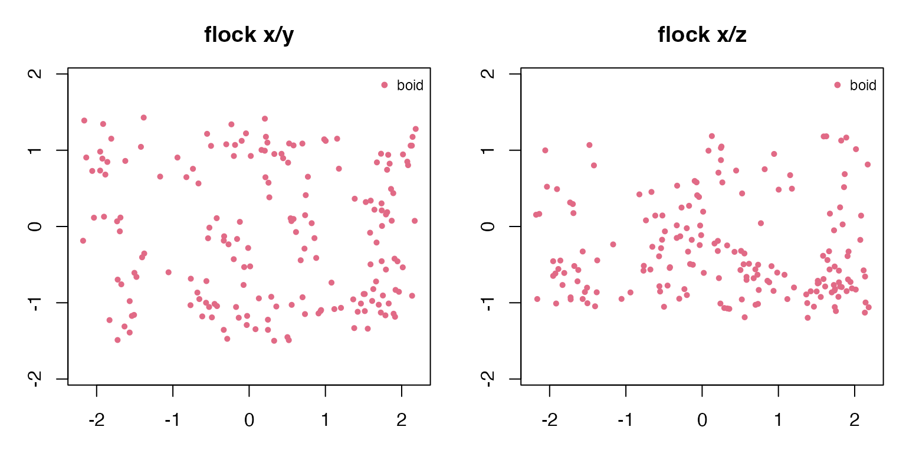
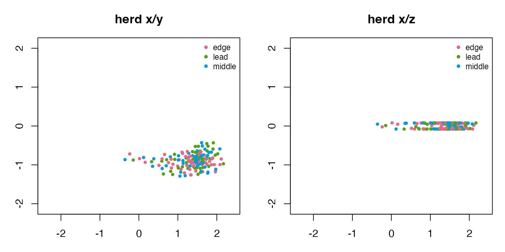
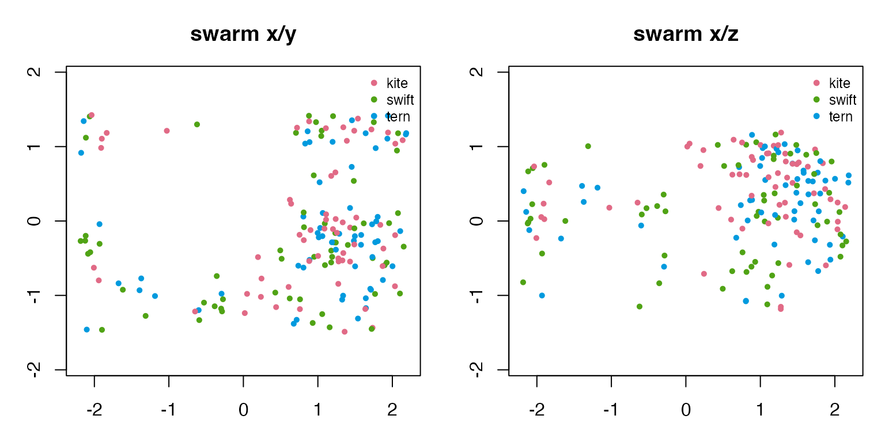
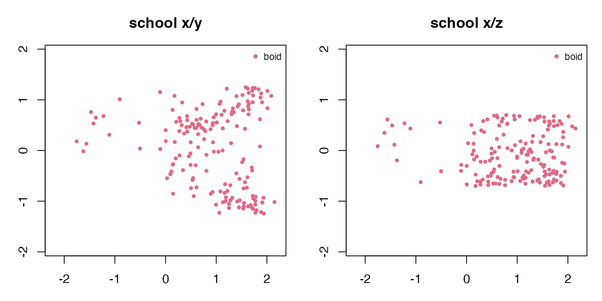
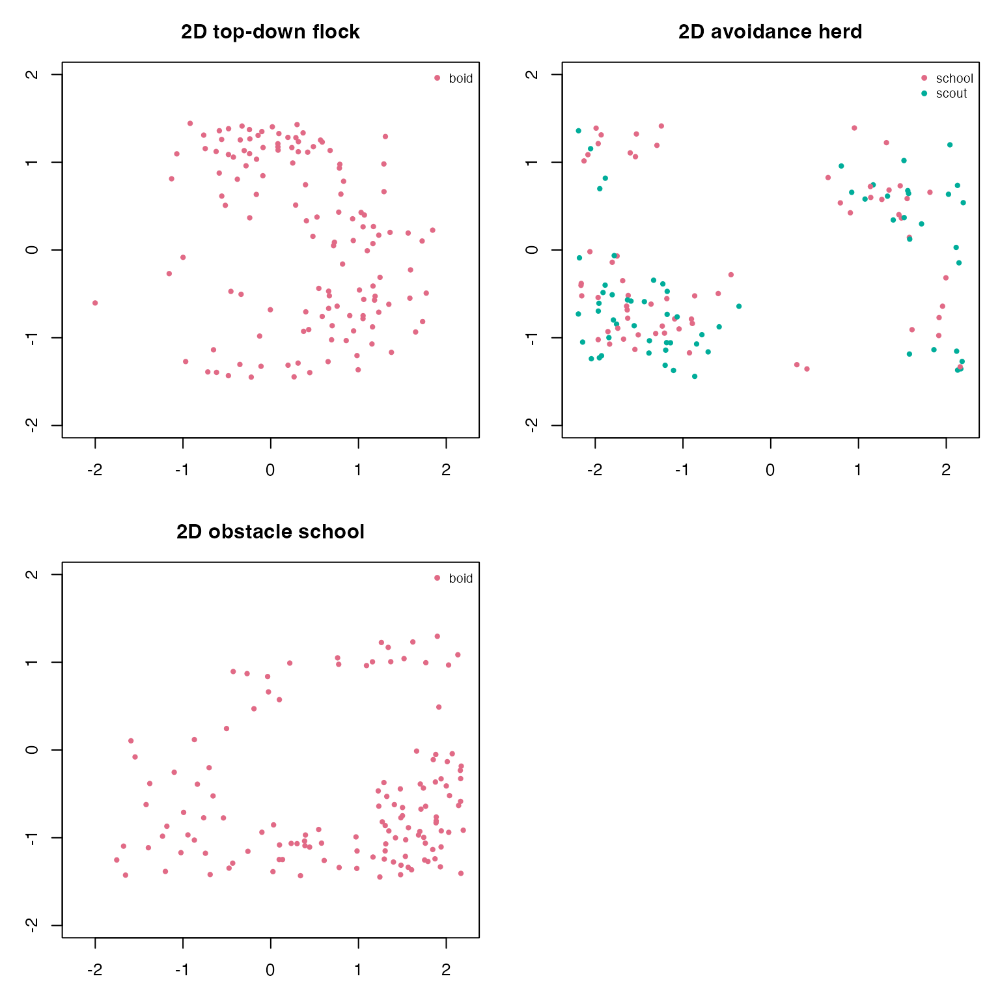

# Flocks, Herds, Swarms, and Schools

The same boids rules can be tuned to read as different collective-motion
patterns. This vignette uses 3D examples as the main view, then adds 2D
overhead variants where they help explain the movement.

``` r
library(boids4R)
```

## Helpers

``` r
final_frame <- function(sim) {
  frames <- as.data.frame(sim)
  frames[frames$frame == max(frames$frame), , drop = FALSE]
}

mean_nearest_neighbor <- function(frame) {
  if (nrow(frame) < 2L) return(NA_real_)
  coords <- as.matrix(frame[, c("x", "y", "z"), drop = FALSE])
  distances <- as.matrix(stats::dist(coords))
  diag(distances) <- NA_real_
  mean(apply(distances, 1L, min, na.rm = TRUE), na.rm = TRUE)
}

movement_summary <- function(sim, label) {
  frames <- as.data.frame(sim)
  final <- final_frame(sim)
  data.frame(
    label = label,
    dimension = sim$dimension,
    boids = length(unique(final$id)),
    species = paste(sort(unique(final$species)), collapse = ", "),
    frames = length(unique(frames$frame)),
    mean_speed = round(mean(final$speed), 3),
    xy_spread = round(mean(sqrt((final$x - mean(final$x))^2 + (final$y - mean(final$y))^2)), 3),
    z_spread = round(stats::sd(final$z), 3),
    mean_nearest_neighbor = round(mean_nearest_neighbor(final), 3),
    stringsAsFactors = FALSE
  )
}

species_palette <- function(species) {
  keys <- sort(unique(species))
  stats::setNames(grDevices::hcl.colors(length(keys), "Dark 3"), keys)
}

draw_projection <- function(sim, title, x_axis = "x", y_axis = "y") {
  final <- final_frame(sim)
  world <- sim$world
  palette <- species_palette(final$species)
  xlim <- if (x_axis %in% rownames(world$bounds)) world$bounds[x_axis, ] else range(final[[x_axis]])
  ylim <- if (y_axis %in% rownames(world$bounds)) world$bounds[y_axis, ] else range(final[[y_axis]])

  graphics::plot(
    final[[x_axis]], final[[y_axis]],
    xlim = xlim,
    ylim = ylim,
    asp = 1,
    xlab = x_axis,
    ylab = y_axis,
    main = title,
    col = palette[final$species],
    pch = 16,
    cex = 0.7
  )
  graphics::legend("topright", legend = names(palette), col = palette, pch = 16, bty = "n", cex = 0.75)
}

draw_two_projections <- function(sim, title) {
  old_par <- graphics::par(mfrow = c(1, 2), mar = c(3, 3, 3, 1))
  draw_projection(sim, paste(title, "x/y"), "x", "y")
  draw_projection(sim, paste(title, "x/z"), "x", "z")
  graphics::par(old_par)
}
```

## Build example simulations

Flocks and swarms use the named 3D scenarios. The school example narrows
the 3D bounds into a water-column shape. The herd example is also 3D,
but with a shallow vertical extent to represent animals moving over
uneven ground.

``` r
flock_3d <- boids_scenario(
  "murmuration_3d",
  n = 180,
  steps = 70,
  record_every = 5,
  seed = 501
)

swarm_3d <- boids_scenario(
  "mixed_species_3d",
  n = 180,
  steps = 70,
  record_every = 5,
  seed = 502
)

school_bounds <- matrix(
  c(-2.2, -1.25, -0.7, 2.2, 1.25, 0.7),
  ncol = 2,
  dimnames = list(c("x", "y", "z"), c("min", "max"))
)
school_3d <- simulate_boids(
  boids_state(170, "3d", bounds = school_bounds, seed = 503),
  boids_world(
    "3d",
    bounds = school_bounds,
    boundary = "wrap",
    attractors = data.frame(x = 0.75, y = -0.15, z = 0.05, strength = 0.32)
  ),
  boids_params(
    "3d",
    separation_weight = 1.20,
    alignment_weight = 1.15,
    cohesion_weight = 0.98,
    cohesion_radius = 0.72,
    alignment_radius = 0.55,
    max_speed = 1.20,
    noise = 0.001
  ),
  steps = 70,
  record_every = 5,
  seed = 504
)

herd_bounds <- matrix(
  c(-2.4, -1.35, -0.08, 2.4, 1.35, 0.08),
  ncol = 2,
  dimnames = list(c("x", "y", "z"), c("min", "max"))
)
herd_i <- seq_len(150)
herd_positions <- cbind(
  seq(-2.15, -1.25, length.out = 150),
  0.55 * sin(0.23 * herd_i),
  0.015 * cos(0.17 * herd_i)
)
herd_velocities <- cbind(
  0.26 + 0.16 * sin(0.11 * herd_i),
  0.08 * cos(0.19 * herd_i),
  0.005 * sin(0.29 * herd_i)
)
herd_3d <- simulate_boids(
  boids_state(
    150,
    "3d",
    bounds = herd_bounds,
    positions = herd_positions,
    velocities = herd_velocities,
    species = rep(c("lead", "middle", "edge"), length.out = 150),
    seed = 505
  ),
  boids_world(
    "3d",
    bounds = herd_bounds,
    boundary = "reflect",
    predators = data.frame(x = -1.75, y = 0.95, z = 0, radius = 0.72, strength = 0.9),
    attractors = data.frame(x = 2.0, y = -0.45, z = 0, strength = 0.55)
  ),
  boids_params(
    "3d",
    separation_weight = 1.05,
    alignment_weight = 0.92,
    cohesion_weight = 0.86,
    predator_weight = 2.4,
    goal_weight = 0.18,
    max_speed = 1.05,
    max_force = 0.095,
    noise = 0.0005
  ),
  steps = 75,
  record_every = 5,
  seed = 506
)
```

## Compare the 3D examples

``` r
examples_3d <- list(
  flock = flock_3d,
  herd = herd_3d,
  swarm = swarm_3d,
  school = school_3d
)

do.call(rbind, Map(movement_summary, examples_3d, names(examples_3d)))
#>         label dimension boids            species frames mean_speed xy_spread
#> flock   flock        3d   180               boid     15      1.194     1.446
#> herd     herd        3d   150 edge, lead, middle     16      1.050     0.431
#> swarm   swarm        3d   180  kite, swift, tern     15      1.232     1.289
#> school school        3d   170               boid     15      1.195     1.006
#>        z_spread mean_nearest_neighbor
#> flock     0.634                 0.253
#> herd      0.069                 0.091
#> swarm     0.588                 0.254
#> school    0.453                 0.212
```

The x/y view shows the collective shape from above. The x/z view reveals
which examples use a full 3D volume and which stay near a ground or
water layer.

``` r
draw_two_projections(flock_3d, "flock")
```



``` r
draw_two_projections(herd_3d, "herd")
```



``` r
draw_two_projections(swarm_3d, "swarm")
```



``` r
draw_two_projections(school_3d, "school")
```



## 2D variants

Overhead 2D examples are useful for corridor, schooling, and avoidance
experiments where the top-down geometry is the main story.

``` r
flock_2d <- boids_scenario(
  "schooling_2d",
  n = 130,
  steps = 60,
  record_every = 5,
  seed = 601
)

herd_2d <- boids_scenario(
  "predator_avoidance_2d",
  n = 130,
  steps = 65,
  record_every = 5,
  seed = 602
)

school_2d <- boids_scenario(
  "obstacle_corridor_2d",
  n = 130,
  steps = 65,
  record_every = 5,
  seed = 603
)

examples_2d <- list(
  top_down_flock = flock_2d,
  avoidance_herd = herd_2d,
  obstacle_school = school_2d
)

do.call(rbind, Map(movement_summary, examples_2d, names(examples_2d)))
#>                           label dimension boids       species frames mean_speed
#> top_down_flock   top_down_flock        2d   130          boid     13      1.147
#> avoidance_herd   avoidance_herd        2d   130 school, scout     14      0.906
#> obstacle_school obstacle_school        2d   130          boid     14      0.999
#>                 xy_spread z_spread mean_nearest_neighbor
#> top_down_flock      1.142        0                 0.144
#> avoidance_herd      1.658        0                 0.118
#> obstacle_school     1.279        0                 0.134
```

``` r
old_par <- graphics::par(mfrow = c(2, 2), mar = c(3, 3, 3, 1))
draw_projection(flock_2d, "2D top-down flock", "x", "y")
draw_projection(herd_2d, "2D avoidance herd", "x", "y")
draw_projection(school_2d, "2D obstacle school", "x", "y")
graphics::par(old_par)
```



## Animate with ggWebGL

When `ggWebGL` 0.4.0 or later is installed, any of these simulations can
be handed to the optional adapter for timeline animation. Current boids
are larger than trail points, recent history is faint, and velocity
vectors inherit species colours unless a fixed or role-based vector
colour policy is requested.

``` r
if (requireNamespace("ggWebGL", quietly = TRUE) &&
    utils::packageVersion("ggWebGL") >= "0.4.0") {
  spec <- as_ggwebgl_spec(flock_3d, trail_length = 30, shader = "density_splat")
  spec$render$timeline$autoplay <- TRUE
  ggWebGL::ggWebGL(spec, height = 540)
}
```
