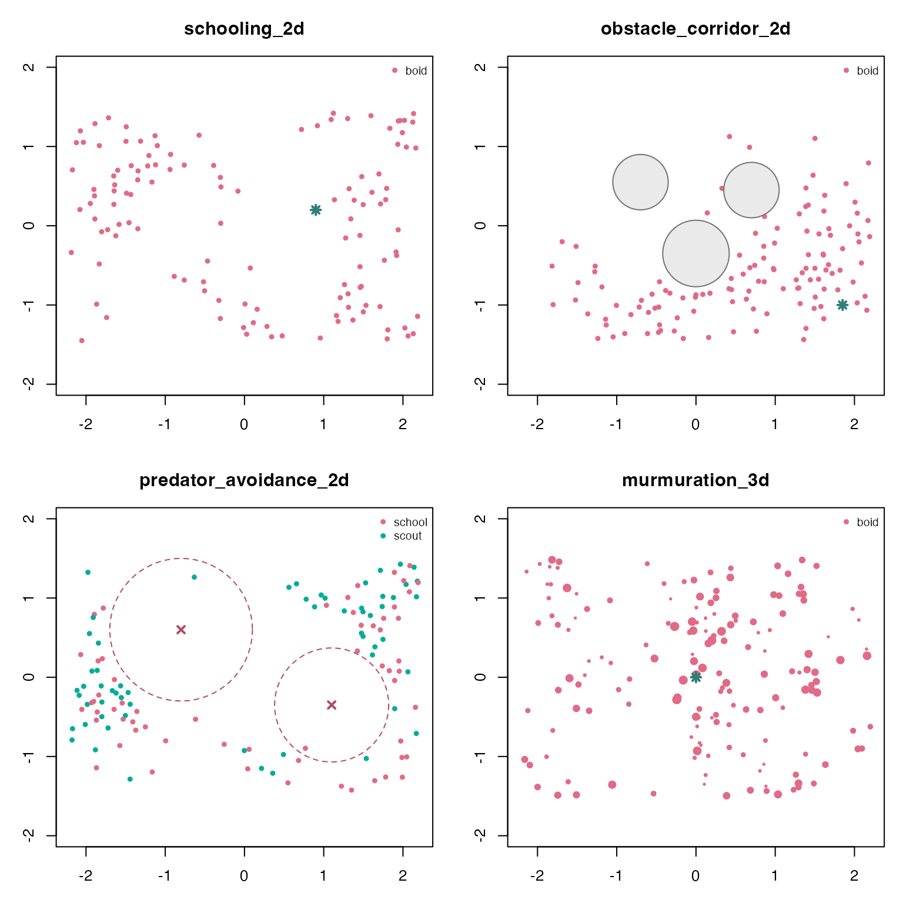

# Scenario Gallery

`boids4R` includes named scenarios for common swarm motifs: compact
schools, obstacle corridors, predator avoidance, and 3D murmurations.
The examples below run each scenario with a fixed seed, then summarize
the recorded frames with plain data-frame operations.

``` r
library(boids4R)

gallery <- data.frame(
  scenario = c(
    "schooling_2d",
    "obstacle_corridor_2d",
    "predator_avoidance_2d",
    "murmuration_3d",
    "mixed_species_3d"
  ),
  n = c(120L, 120L, 120L, 160L, 150L),
  steps = c(60L, 70L, 70L, 55L, 55L),
  record_every = c(5L, 5L, 5L, 5L, 5L),
  seed = c(111L, 112L, 113L, 114L, 115L),
  stringsAsFactors = FALSE
)

sims <- setNames(
  lapply(seq_len(nrow(gallery)), function(i) {
    boids_scenario(
      gallery$scenario[i],
      n = gallery$n[i],
      steps = gallery$steps[i],
      record_every = gallery$record_every[i],
      seed = gallery$seed[i]
    )
  }),
  gallery$scenario
)
```

## Compare recorded swarms

A simulation stores every recorded boid as one row per frame. This makes
it straightforward to compute summaries without any renderer-specific
object model.

``` r
final_frame <- function(sim) {
  frames <- as.data.frame(sim)
  frames[frames$frame == max(frames$frame), , drop = FALSE]
}

mean_spread <- function(frame) {
  center <- colMeans(frame[, c("x", "y", "z"), drop = FALSE])
  distance <- sqrt(
    (frame$x - center["x"])^2 +
      (frame$y - center["y"])^2 +
      (frame$z - center["z"])^2
  )
  mean(distance)
}

mean_nearest_neighbor <- function(frame) {
  if (nrow(frame) < 2L) return(NA_real_)
  coords <- as.matrix(frame[, c("x", "y", "z"), drop = FALSE])
  distances <- as.matrix(stats::dist(coords))
  diag(distances) <- NA_real_
  mean(apply(distances, 1L, min, na.rm = TRUE), na.rm = TRUE)
}

scenario_summary <- function(sim) {
  frames <- as.data.frame(sim)
  final <- final_frame(sim)
  data.frame(
    scenario = sim$scenario,
    dimension = sim$dimension,
    boids = length(unique(final$id)),
    species = paste(sort(unique(final$species)), collapse = ", "),
    recorded_frames = length(unique(frames$frame)),
    mean_final_speed = round(mean(final$speed), 3),
    mean_final_spread = round(mean_spread(final), 3),
    mean_nearest_neighbor = round(mean_nearest_neighbor(final), 3),
    stringsAsFactors = FALSE
  )
}

do.call(rbind, lapply(sims, scenario_summary))
#>                                    scenario dimension boids           species
#> schooling_2d                   schooling_2d        2d   120              boid
#> obstacle_corridor_2d   obstacle_corridor_2d        2d   120              boid
#> predator_avoidance_2d predator_avoidance_2d        2d   120     school, scout
#> murmuration_3d               murmuration_3d        3d   160              boid
#> mixed_species_3d           mixed_species_3d        3d   150 kite, swift, tern
#>                       recorded_frames mean_final_speed mean_final_spread
#> schooling_2d                       13            1.189             1.680
#> obstacle_corridor_2d               15            0.953             1.121
#> predator_avoidance_2d              15            0.879             1.806
#> murmuration_3d                     12            1.202             1.498
#> mixed_species_3d                   12            1.202             1.614
#>                       mean_nearest_neighbor
#> schooling_2d                          0.153
#> obstacle_corridor_2d                  0.142
#> predator_avoidance_2d                 0.137
#> murmuration_3d                        0.277
#> mixed_species_3d                      0.291
```

The same summaries can be split by species. This is useful for mixed
flocks or cases where scouts and schooling agents are initialized
together.

``` r
species_speed <- do.call(rbind, lapply(sims, function(sim) {
  final <- final_frame(sim)
  out <- stats::aggregate(speed ~ species, final, mean)
  out$scenario <- sim$scenario
  out$mean_final_speed <- round(out$speed, 3)
  out[, c("scenario", "species", "mean_final_speed")]
}))

species_speed
#>                                      scenario species mean_final_speed
#> schooling_2d                     schooling_2d    boid            1.189
#> obstacle_corridor_2d     obstacle_corridor_2d    boid            0.953
#> predator_avoidance_2d.1 predator_avoidance_2d  school            0.857
#> predator_avoidance_2d.2 predator_avoidance_2d   scout            0.901
#> murmuration_3d                 murmuration_3d    boid            1.202
#> mixed_species_3d.1           mixed_species_3d    kite            1.205
#> mixed_species_3d.2           mixed_species_3d   swift            1.187
#> mixed_species_3d.3           mixed_species_3d    tern            1.213
```

## Snapshot plots

The frame table is also enough for quick base-R diagnostics. The helper
below draws a final-frame x/y projection, including obstacles,
attractors, and predator influence radii when the scenario defines them.
For 3D scenarios this is an overhead projection; point size varies with
the z coordinate.

``` r
scenario_palette <- function(species) {
  keys <- sort(unique(species))
  stats::setNames(grDevices::hcl.colors(length(keys), "Dark 3"), keys)
}

draw_world_marks <- function(world) {
  if (nrow(world$obstacles)) {
    graphics::symbols(
      world$obstacles$x, world$obstacles$y,
      circles = world$obstacles$radius,
      inches = FALSE,
      add = TRUE,
      fg = "gray45",
      bg = grDevices::adjustcolor("gray70", alpha.f = 0.28)
    )
  }
  if (nrow(world$predators)) {
    graphics::symbols(
      world$predators$x, world$predators$y,
      circles = world$predators$radius,
      inches = FALSE,
      add = TRUE,
      fg = "#B24C63",
      lty = 2
    )
    graphics::points(world$predators$x, world$predators$y, pch = 4, col = "#B24C63", lwd = 2)
  }
  if (nrow(world$attractors)) {
    graphics::points(world$attractors$x, world$attractors$y, pch = 8, col = "#2F7E79", lwd = 2)
  }
}

draw_snapshot <- function(sim) {
  final <- final_frame(sim)
  world <- sim$world
  palette <- scenario_palette(final$species)
  z_span <- diff(range(final$z))
  cex <- if (z_span > 0) 0.45 + 0.85 * (final$z - min(final$z)) / z_span else 0.75

  graphics::plot(
    final$x, final$y,
    xlim = world$bounds["x", ],
    ylim = world$bounds["y", ],
    asp = 1,
    xlab = "x",
    ylab = "y",
    main = sim$scenario,
    col = palette[final$species],
    pch = 16,
    cex = cex
  )
  draw_world_marks(world)
  graphics::legend(
    "topright",
    legend = names(palette),
    col = palette,
    pch = 16,
    bty = "n",
    cex = 0.75
  )
}
```

``` r
old_par <- graphics::par(mfrow = c(2, 2), mar = c(3, 3, 3, 1))
draw_snapshot(sims$schooling_2d)
draw_snapshot(sims$obstacle_corridor_2d)
draw_snapshot(sims$predator_avoidance_2d)
draw_snapshot(sims$murmuration_3d)
```



``` r
graphics::par(old_par)
```

## Hand off to ggWebGL

When `ggWebGL` is installed, the same simulation object can be converted
into a timeline-aware WebGL specification. This step is optional and
leaves the core simulation object renderer-neutral.

``` r
if (requireNamespace("ggWebGL", quietly = TRUE)) {
  ggWebGL::ggWebGL(
    as_ggwebgl_spec(sims$mixed_species_3d, vector_every = 12),
    height = 520
  )
}
```
