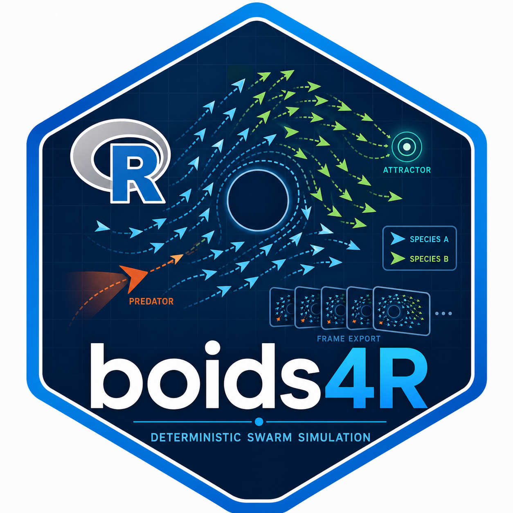

# boids4R, Deterministic Reynolds-style boids and swarm simulations 

## Frédéric Bertrand

`boids4R` provides deterministic Reynolds-style boids and swarm
simulations for R. It owns simulation semantics only: agents, rules,
obstacles, attractors, predators, species, and frame export. Rendering
packages consume the exported frames through optional adapters.

The package is intended to pair cleanly with browser-native renderers
such as `ggWebGL`, without putting camera, shader, widget, or scene
fields into the core simulation objects.

## Example

``` r
library(boids4R)

sim <- boids_scenario("murmuration_3d", n = 400, seed = 1)
frames <- as.data.frame(sim)
head(frames)

if (requireNamespace("ggWebGL", quietly = TRUE)) {
  ggWebGL::ggWebGL(as_ggwebgl_spec(sim), height = 520)
}
```

## References

The model follows the standard boids lineage introduced by Craig
Reynolds: separation, alignment, and cohesion rules produce flocking
behavior through local agent interactions.

- Reynolds, C. W. (1987). Flocks, herds and schools: A distributed
  behavioral model. ACM SIGGRAPH.
- Craig Reynolds boids page: <https://www.red3d.com/cwr/boids/>
